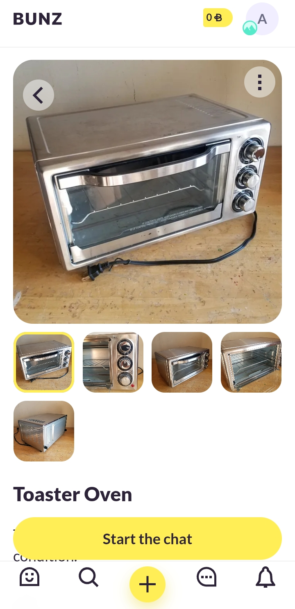
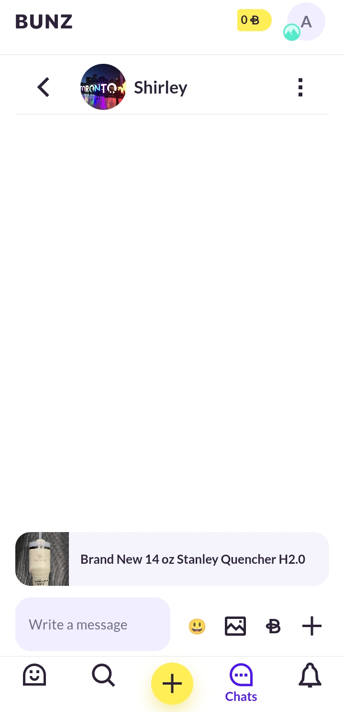
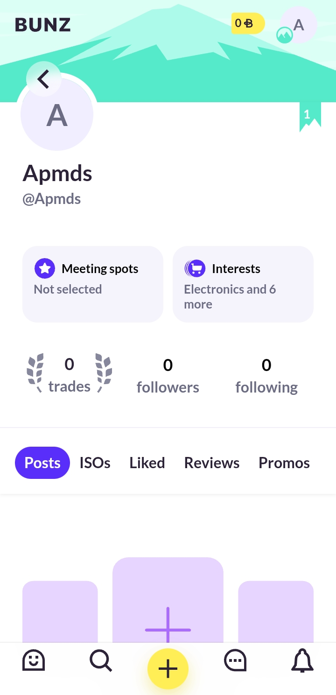
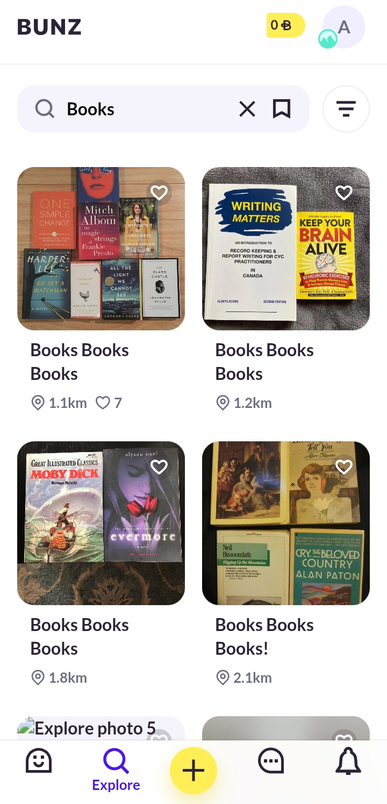

# Competitor Analysis: Bunz
## General Information 
- **Name of System:** Bunz 
- **Company/Developer:** Bunz 
- **Website/Product Page:** <https://bunz.com>
- **Version/Release Date:** 6.1.2 / 07/07/2016
- **Platform(s) Supported:** Web, Mobile (iOS/Android) 
- **Target Audience:** Users interested in exchanging their items for others

--- 
## Core Functionality 

**Primary Purpose:** [Briefly describe what the system is designed to do] 
- Trade any type of items with other users.

**Key Features:**
- Trade any item with random people
- Filter items by various criteria
- Start chatting with users

**Unique Selling Points (USPs):** - [What makes this system stand out?] 
- The possiblity to trade any type of item. 

**Limitations/Weaknesses:** - [Any known shortcomings or pain points] 
- Limited number of users.
- BTZ has no specific value, so any user can ask for large quantities of it.
- The home page has almost no relevant information, and most of what is there must be found by scrolling to the side.
- No function to send an image to chat.
- No way of deleting a post after a chat about it has been created.

---

## Screenshots

## Online Reviews

### From the App store:

### Justine_K, 2022-10-19 (1 star)
#### New app is a joke
This is ridiculous, bring the old app back! The app currently unusable as it is. You see posts from other cities, can no longer see who likes post, lost all ISO lists, lost all reviews, pics are cropped and can’t be zoomed in, can’t send pictures through chats, can no longer see notifications when someone sends a message or likes a post. I wrote feedback to the Bunz teams, but haven’t heard back, and the app is still the same even a few weeks after release. What a terrible idea to release a new product without testing it (and taking away a product that was working well).

### Lene123_, 2019-01-01 (5 stars)
#### It’s truly great!
Bunz has encouraged me to consider the value of the things I have. It has also helped me declutter, save money, give to local and independent shops, and meet new and lovely people. I would recommend this app to anyone of any age or demographic. It’s truly great.

### Smetty to da max, 2022-10-08 (1 star)
#### Worst update ever
New update completely deleted my account and the option to send yourself a password reset never actually sends an email. So I’m fully locked out, have lost all access to all my posts and pending trades. Really disappointing as I loved this app before.
