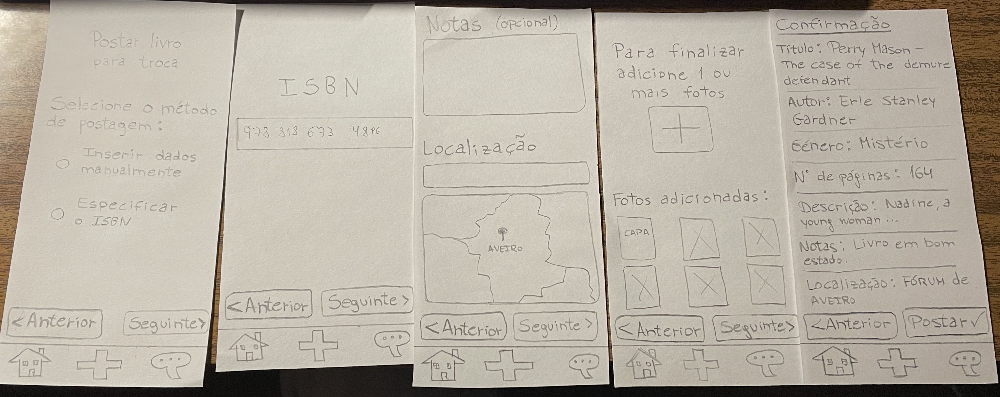

[Back to main Logbook Page](../hci_logbook.md)

---
# Low Fidelity Prototype and Evaluation

Tarefas:
 - "És um leitor de livros e adoras livros de ficção científica, romance e thriller, atualiza os teus géneros preferidos."

 - "Disponibiliza o livro Perry Mason - The Case of the Demure Defendant (ISBN 978-8186734896) para outras pessoas o poderem ver, mencionando que preferes encontrar-te no Fórum Aveiro para o trocar e que ele não tem defeitos físicos, adicionando uma foto da capa e outra foto da contracapa." 

 - "Procura descobrir se está disponível o livro O Hobbit e se estiver, vê em detalhe a postagem que tiver as melhores classificações, envia um "Olá!" ao dono do livro e propoe-lhe uma troca. Essa troca será do livro que acabaste de disponibilizar, para o dia de hoje (1 de abril) às 15:30 no Fórum Aveiro."

 - "Estás à procura do livro "Na Rota de Vasco da Gama - Uma Aventura em Portugal" do Gerónimo Stilton para ler. Se não encontrares, regista-o na aplicação para seres lembrado quando alguém o disponibilizar."

 - "Alguém enviou-te uma mensagem! Vê quem foi e o que disseram, e responde de acordo."

## D.1. Low Fidelity Prototype
<table>
    <td>
        
    </td>
    <td>
        
    </td>
    <td>
        
    </td>
    <td>
        
    </td>
    <td>
        
    </td>
    <td>
        
    </td>
    <td>
        
    </td>
</table>

## D.2. Prototype Evaluation

With the prototype evaluation, we found certain things that need to be changed or/and improved:
- New messages on top (on the chat screen)
- Chat icon indication if new messages
- Indicate better which book is ours (selecting book to trade)
- Add to wishlist by profile
- Indicate better which book belongs to each user
- Better genre selection (maybe a checkbox)
- Optional notes at the end, when posting a book
- Search for location (not only select on the map)
- Feedback when selecting favorite genres
- It's not clear if the books in the feed are ours or not
- It's better to display the isbn dashes in the textfield, to help the user confirm
- After enter the isbn, know imediatly the book, to know if it's the correct one
- Choose more than one book to trade
- Allow the other person to see our books and choose which ones tehy want to exchange
- Bigger icons
- Search icon is a bit hidden
- **Some confusion choosing the book to trade**

---
[Back to main Logbook Page](../hci_logbook.md)

---
