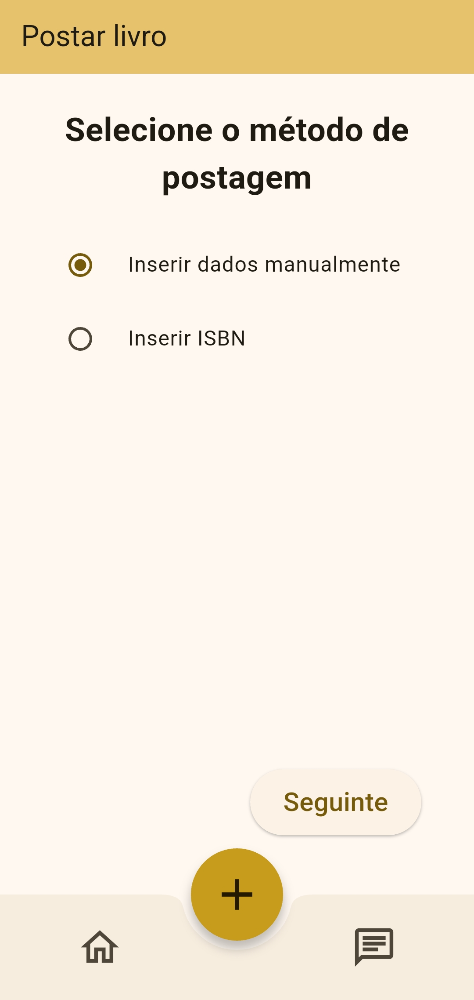

[Back to main Logbook Page](../hci_logbook.md)

---

# E. Functional Prototype and Evaluation

# Tasks:

- "You love science fiction, romance and thriller books. With that, update your favourite genres."

- "Make the book “Perry Mason - The Case of the Demure Defendant” (ISBN 978-0345-371-485) available for other people to see, mentioning that your preferred meeting place is Fórum Aveiro and that the book itself does not have physical damage. Also add a cover and back cover photo."

- "Find the book “O Hobbit” with the best ratings and open its page."

- "Propose an exchange to the owner of the book you found before. This exchange will involve the book you just made available (Perry Mason - The Case of the Demure Defendant), and it will take place today at 3:30pm at the Forum Aveiro."

- "You are looking for the book “Um Amigo Surpresa” by Geronimo Stilton to read. If you can’t find it, register it in the app to be reminded when someone makes it available."

# Prototype
<table>
<tr>
    <td>
        
    </td>
    <td>
        
    </td>
    <td>
        
    </td>
    <td>
        
    </td>
    </tr>
    <tr>
    <td>
        
    </td>
    <td>
        
    </td>
    <td>
        
    </td>
    <td>
        
    </td>
    <td>
        
    </td>
    <td>
        
    </td>
    </tr>
</table>

# E.X. User Evaluation

[User screen recordings](https://drive.google.com/drive/folders/1ml2vwxHAi8qVEqWIX87hyjiFsuQmDWBM?usp=sharing)

With the prototype evaluation, we found certain things that need to be changed or/and improved:

- In the chat, the menu to select the book needs to disappear when tapping out
- Select location on search
- Change select locationn text
- Lock rotation
- Post notification more visible
- Search result when typing on the searchbar
- Sort search results
- Better indicate that the button "Aceitar troca" was taped
- Bigger buttons to edit the profile
- It's better to display the isbn dashes in the textfield, to help the user confirm
- Return directly to the home page when you have just posted a book
- Better indicate the names of the users when trading
- Snackbar when adding a book to the wishlist

---
[Back to main Logbook Page](../hci_logbook.md)

---