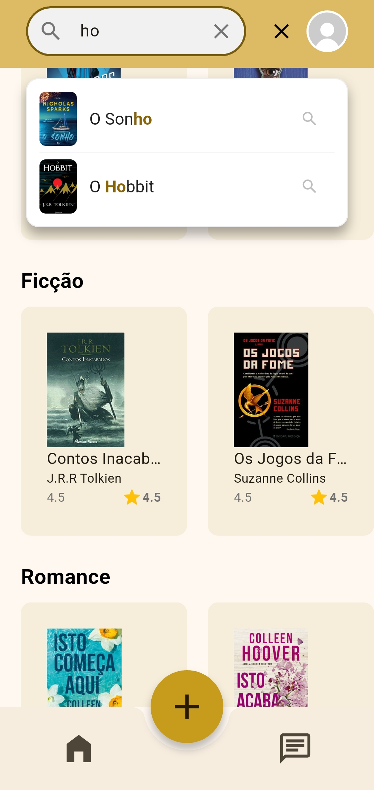
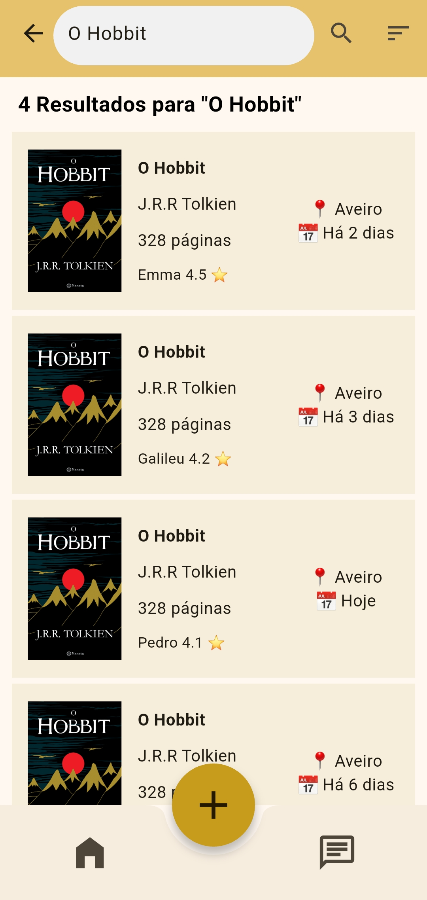
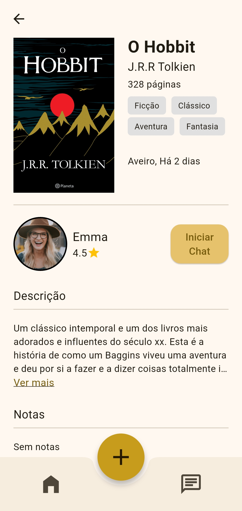
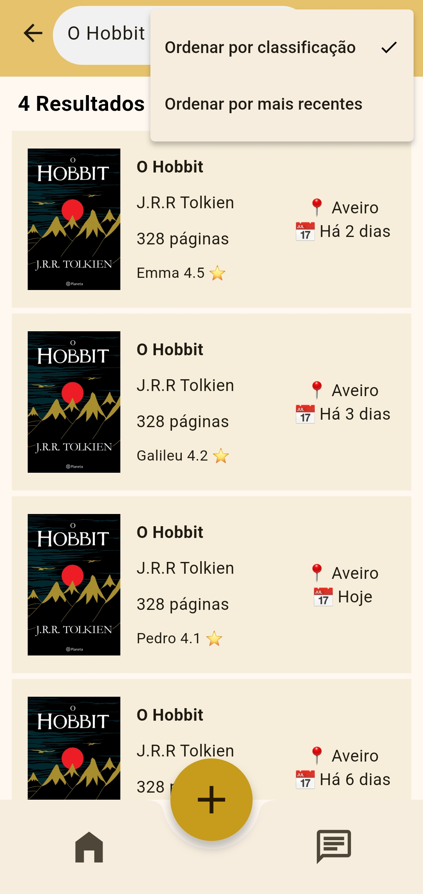
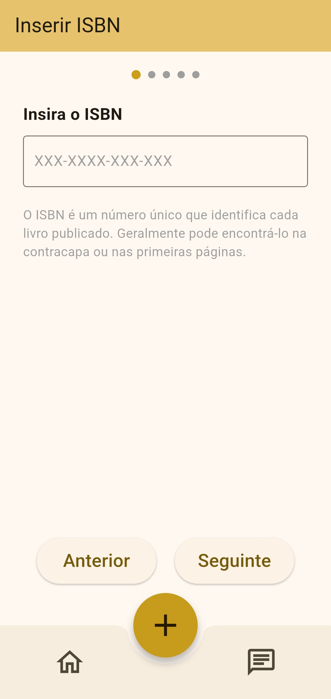
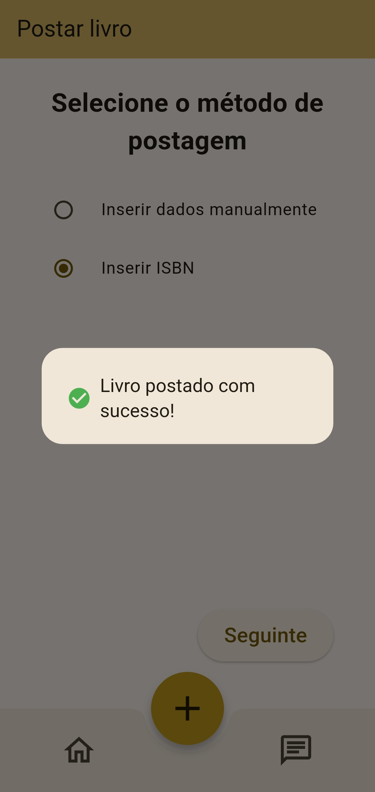
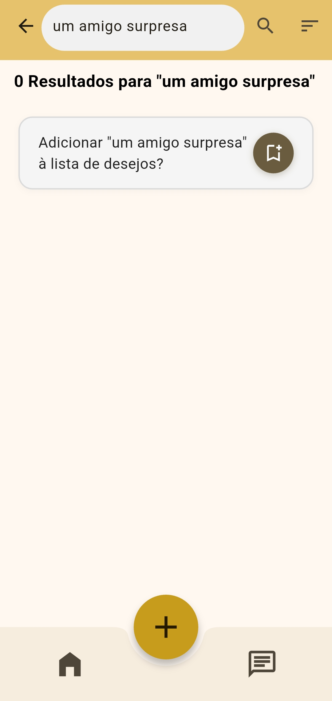

[Back to main Logbook Page](../hci_logbook.md)

---

# F. Discussion of Evaluation Results

# Refinement List

- Searching for a book in the home screen now has suggestions and search history.
- Searching in the search screen now updates the results as the search is being made.
- The buttons for editing the profile are easier to be clicked on.
- Posting a book now has a clearer aknowledgement message.
- Search results can be ordered by user rating or by the date of posting.
- Most screens now have the bottom app bar, so going back to the main menu is less clicks away.
- ISBN insertion is more straightforward (the hyphens are added automatically to make it simpler to verify).
- Added a popup for when the user has no internet.
- In the chat, leaving the 'Livros para trocar' sub-menu can be done by clicking anywhere outside of it.

# Refined Prototype

## Search history and suggestions

## Added the main bar in the bottom of more screeens

## Ability to order the search results

## ISBN insertion more straightforward

## Better aknowledgement for posting a book

## More visible suggestion to add to wishlist

---
[Back to main Logbook Page](../hci_logbook.md)

---